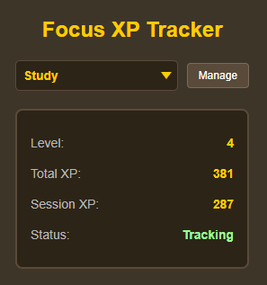
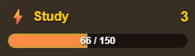

# Focus XP Tracker

A Chrome extension that gamifies web browsing by awarding XP for clicks, typing, and scrolling.

## Preview


*Top of the main extension popup showing XP tracking*


*On-screen XP bar with level progression and XP drops*

## Installation

1. Go to `chrome://extensions/` and enable "Developer mode"
2. Click "Load unpacked" and select the extension folder
3. The extension icon will appear in your toolbar

## How to Use

1. **Start Earning XP**: Earn XP automatically and achieve milestone XP totals to unlock special tracker borders
   - Clicks: 2 XP each
   - Typing: 3 XP per 10 keystrokes  
   - Scrolling: 1 XP (with cooldown)

2. **Multiple Trackers**: Use the dropdown to switch between different activity trackers (Work, Study, etc.)

3. **Block Distracting Sites**: Add websites to block XP gain on time-wasting sites

4. **Pause/Resume**: Toggle tracking on/off as needed

5. **Display features**: Turn XP drops, level up animation, and border trim off as preferred

## Customizing Difficulty

The extension uses an exponential leveling system. To adjust difficulty, edit the `getLevelFromXp()` function in `content.js` and `popup.js`:

```javascript
// Experience required = floor(points/4) where points = level + 300 * 2^(level/3)

// For easier leveling, reduce the exponential factor:
points = level + 150 * 2^(level/4)  // Easier

// For harder leveling, increase it:
points = level + 600 * 2^(level/2.5)  // Harder
```

You can also modify XP values in `content.js`:
```javascript
const XP_VALUES = {
  click: 2,     // Change click XP
  typing: 3,    // Change typing XP
  scroll: 1     // Change scroll XP
};
```
